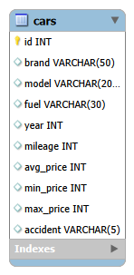

# 📚중고차 정밀 시세 조회 및 자차 견적 서비스 🚘🚗

## ⭐️ 팀 구성
<div align="center">

**🔥SKN31-1ST-4TEAM🔥**
---

<table align="center">
  <tr>
    <td align="center" width="190px"></td>
    <td align="center" width="190px"></td>
    <td align="center" width="190px"></td>
    <td align="center" width="190px"></td>
  </tr>
  <tr>
    <td align="center"><b>안혁진</b></td>
    <td align="center"><b>박하린</b></td>
    <td align="center"><b>박연아</b></td>
    <td align="center"><b>김가율</b></td>
  </tr>
  <tr>
    <td align="center"><sub><b>PM</br>METHOD ENGINEERING</br>HTML</b></sub></td>
    <td align="center"><sub><b>STREAMLIT</br>DATABASE</br>HTML</b></sub></td>
    <td align="center"><sub><b>DATA CRAWLING</br>DATABASE</b></sub></td>
    <td align="center"><sub><b>DATA CRAWLING</br>STREAMLIT</b></sub></td>
  </tr>
  <tr>
    <td align="center"><a href="https://github.com/Jinxxxok"></a></td>
    <td align="center"><a href="https://github.com/MintRinne"></a></td>
    <td align="center"><a href="https://github.com/yeona9549"></a></td>
    <td align="center"><a href="https://github.com/Kim-gayul"></a></td>
  </tr>
</table>

</div>

---
## 목차
 - [개요](#개요)
 - [사용법](#사용법)
 - [Github 폴더 구조](#-GitHub-폴더-구조)
 - [Tech Stack](#-Tech-Stack)
 - [ERD](#ERD)
 - [Method List](#Method-List)
 - [데이터 출처 및 활용 현황](#데이터-출처-및-활용-현황)
 - [팀원 회고](#팀원-회고)
---
## 개요
> <font size="3">중고차 시장 데이터를 수집·분석하여 차량의 평균 시세, 가격 범위, 자차 견적을 제공하고, \
사용자가 합리적인 가격으로 거래할 수 있도록 돕는 데이터 기반 플랫폼</font>

---
## 사용법

terminal에서 실행 후
>pip install ./requirement.txt

실행환경에서 실행
> streamlit run main.py 실행


---
## 📁 GitHub 폴더 구조

```
SKN31-1st-4Team/
├── README.md  
├── main.py                           # 메인 streamlit 구동 파일
├── requirement.txt                   # 써드파티 모듈 환경설정 파일
├── .gitignore
│
├── assets/
│   ├── app.css                       # 메인 css 파일
│   └── images/
│       └── main_top_banner.png       # 배너 사진
│
├── images/                           # README 사진
│   ├── Gani.png
│   ├── Rani.png
│   ├── Rogi.png
│   ├── Tayo.png
│   └── ERD_images.png
│
├── pages/  
│   ├── 01_Market_Price.py            # 1페이지
│   └── 02_My_Car.py                  # 2페이지
│
└── src/
    ├── car_repository.py             # MySQL에서 데이터를 가져오는 메소드 모음
    ├── data_processor.py             # DB에서 받은 데이터를 화면 출력용으로 가공하는 함수 모음
    ├── utils.py                      # Streamlit 화면 출력 관련 공통 함수 모음
    ├── __init__.py
    └── csv/
        ├── usedcar_info.csv          # 전체 차량 데이터셋 csv
        └── DB_init.py                # DB 제작 + CSV파일 적재용 파일 (1회 구동)
```
### 💪🏻 Tech Stack
<table align="center">
  <tr>
    <td align="center" width="220">
      <strong>Frontend</strong><br/><br/>
      
      
    </td>
    <td align="center" width="220">
      <strong>Backend</strong><br/><br/>
      
      
      
    </td>
    <td align="center" width="220">
      <strong>Data</strong><br/><br/>
      
      
    </td>
  </tr>
</table>

### ERD
<td align="center" width="190px"></td>

### Method List
```
===============================================================================================================
[Car_repository.py] - MySQL에서 데이터를 가져오는 메소드 모음
===============================================================================================================
- def get_cars(brand_list, fuel_list, accident, price_min, price_max, mileage_max, year_min, year_max, sort)
>> Page1 / 차량 목록 조회하는 메소드
 
- def count_cars(brand_list, fuel_list, accident, price_min, price_max, mileage_max, year_min, year_max) 
>> Page1 / 검색 결과 건수 표시 & 페이지 수 계산 사용하는 카운트 메소드

- def search_my_car(brand, model_keyword) 
>> page2 / 제조사+모델명 키워드 검색 메소드

- def get_price_stats(brand, model_keyword) 
>> page2 / 유사 차량 시세 통계 메소드

- def get_brands() 
>> all Page / 제조사 목록 사이드바 체크박스용 메소드

- def get_fuel_types() 
>> all Page / 연료 종류 목록 사이드바 체크박스용 메소드

- def get_summary_stats() 
>> all Page / 전체 요약 통계 매물 수, 평균 시세, 최신 연식 출력하는 메소드
===============================================================================================================
[data_processor.py] - DB에서 받은 데이터를 화면 출력용으로 가공하는 메소드 모음
===============================================================================================================
- def format_year(year_int)
>> 연식 포맷을 0000년 00월로 수정해주는 메소드

- def build_card_html(car)
>> 차량 정보를 카드 HTML로 변환해주는 메소드

- def cars_to_dataframe(cars)
>> 차량 목록을 Pandas모듈을 이용해 dataframe형태로 변환해주는 메소드

- def get_price_verdict(my_price, stats)
>> page2 내 차와 유사 매물 평균가를 비교해 시세보다 어떤지 판별문을 출력하는 메소드

- def build_filter_summary(brand_list, fuel_list, accident, price_min, price_max, mileage_max, year_min, year_max)
>> 선택한 필터들을 정리해서 요약해주는 메소드
===============================================================================================================
[utils.py] - STREAMLIT 화면 출력 관련 공통 메소드 모음
===============================================================================================================
- def load_css(path="assets/app.css")
>> CSS 파일 불러와서 연결

- def render_car_cards(cars, columns=3)
>> 차량 카드 렌더링해주는 메소드 *columns= 한줄에 몇 개를 띄울지 설정

- def render_metrics(metrics)
>> 지표를 한줄로 정리해주는 메소드

- def render_pagination(total, page_size, key="page")
>> 페이지 저장을 위한 메소드 페이지 초기화를 방지하기 위해 만듬

- def fmt_price(val)
>> 가격 출력 형식을 세자리 구분자, 로 나눠주는 메소드 * 결측치라면 -로 출력
```


### 데이터 출처 및 활용 현황

#### Encar   중고차 실매물 시세 정보 (usedcar_info.csv)
#### 전국자동차매매사업조합연합회    자동차 매매업계 공인 시세 정보 (usedcar_info.csv)
**============== 약 3000 여대 ==============**

#### [활용현황]
**민간·공공 중고차 데이터를 결합하여 브랜드·모델별** \
**최적 시세 산출 및 사고 이력을 반영한 가치 평가 모델 구축에 활용함.**

---

## 팀원 회고


### 김가율 
```
1차 프로젝트가 주어졌을 때 굉장히 당황스러웠다.
뭘 어떻게 어디서부터 해야하는지 막막했다. 그래서 먼저 나서기 어려웠다.
관련업무 비전공이라는 벽이 눈 앞에 떡하니 서있는 것 같았다. 
하지만 열정넘치는 팀원들 덕분에 원활하게 업무를 분담하고 마무리 지을 수 있었다.
1차 프로젝트 덕분에 실전을 경험할 수 있었고, 수업 내용을 좀 더 깊게 이해할 수 있는 계기가 됐다. 
Thanks to 4Team.
```
### 안혁진
```
처음 해보는 팀프로젝트 + 프로젝트 매니저 모든게 다 처음이라 너무 막막했지만.
모든 분야에서 활약해오던 팀원들과 점점 친해지며 불가능할 것 같았던 일들도
순탄히 해결해 나가는 과정을 겪었고 처음 해보는 분업 시스템에 난감했던 찰나에
다행히 뭐든 다 해보겠다는 열정이 넘치는 팀원들 덕분에 두루뭉실 했던 계획에도 길이 그려지기 시작했다.
수업 내용을 기반으로 다같이 으쌰으쌰 길을 따라 열심히 달려 모두의 힘으로 
이번 프로젝트가 성공적으로 마무리 될 수 있었다고 생각한다.
```
